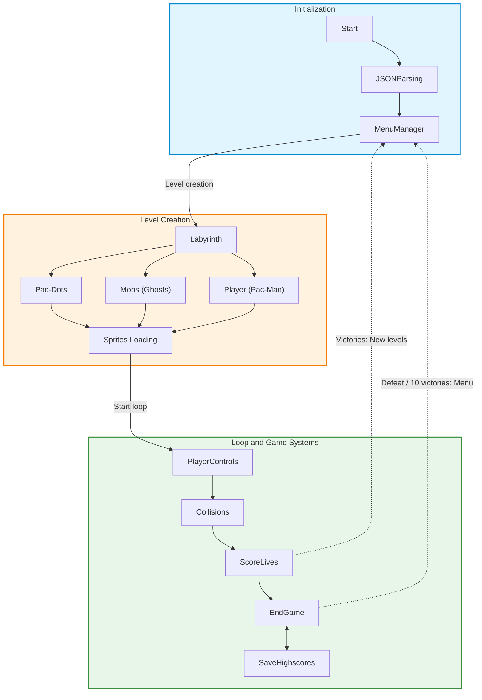
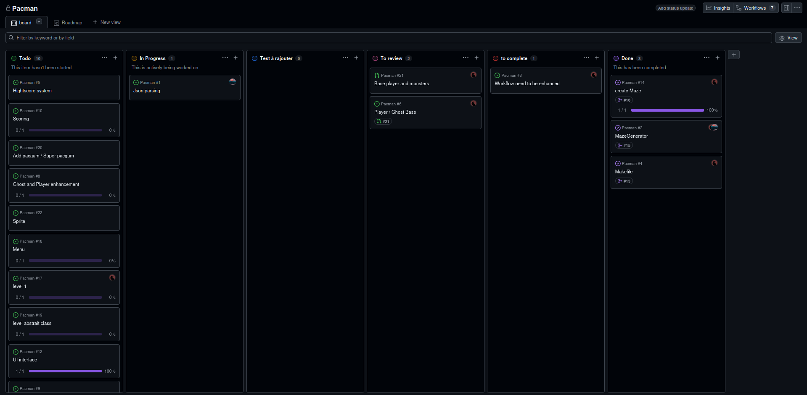
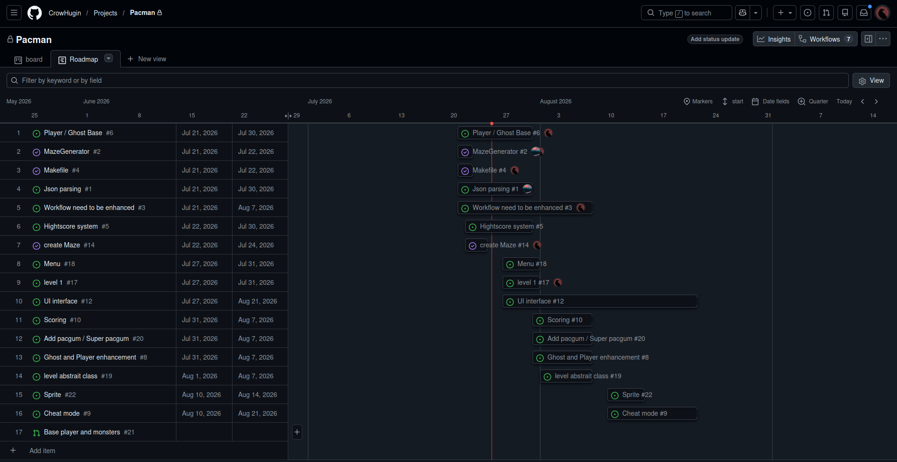
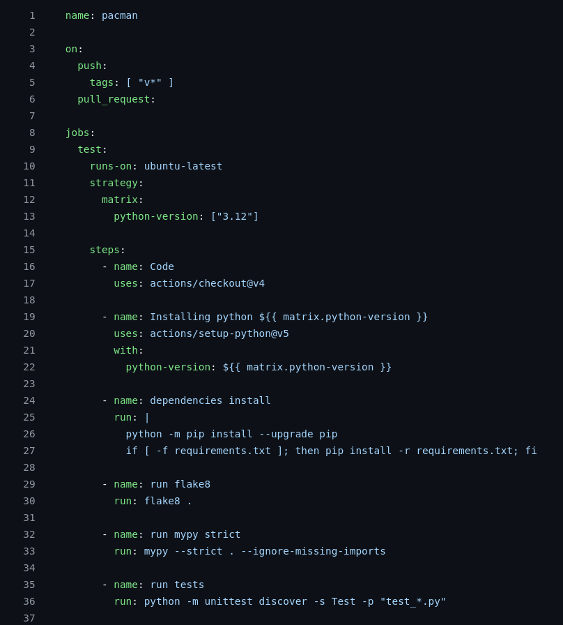

*This activity has been created as part of the 42 curriculum by ahalifa and bkuntz*

---
## ***Description***

This activity is about to recreate a pacman from a maze generator.  
The player will control pacman, to win the game, you will have to eat all the pacgum from a defined number of level while avoiding the ghost chasing you or not.

---
## ***Instructions***
To run the program, launch the command `make`.  
It will automatically install all the dependenc needed and start the program.

**Building the Executable**:

Run make install followed by `pyinstaller --onefile pac-man.py`.

Go to the newly created dist/ directory.

Launch the game using ./pac-man.

**Configuration**:

By default, the game uses the base configuration. For custom settings, pass your configuration file as an argument:

./pac-man path/to/config.json  

**Makefile**

| Commands    | Use                                 |
| ----------- | ----------------------------------- |
| all         | Default behavior see run            |
| run         | Run the script within the env       |
| debug       | Run debuger                         |
| clean       | Remove all cache file and venv      |
| lint        | Run flake8 and mypy                 |
| lint-strict | Run flake8 and mypy --strict        |
| tests       | Run Tests, see Test folder          |
| build       | make the build                      |

## ***Resources***

- [unittest](https://docs.python.org/3/library/unittest.html)
- [pygame](https://www.pygame.org/docs/)
## *Configuration*
| Config                    | Description                           | Default Value           |
| ------------------------- | ------------------------------------- | ----------------------- |
| highscore filename        | Name scores file                      | score.json              |
| number level              | Number of levels for the game         | 10                      |
| level size                | Size of a maze                        | width : 15, height : 15 |
| lives                     | Number lives for the player           | 3                       |
| points per pacgum         | Points win when  pacgum got eat       | 20                      |
| points per super pacgum   | Points win when super pacgum got eat  | 50                      |
| points per ghost          | Points win when ghost got eat         | 200                     |
| seed                      | Seed for the generation of the maze   | 42                      |
| level max time            | Time limit for a level                | 360                      |
---
## *Highscore*

The highscore will only keep the 10 best scores. If a player is already registered, we keep the best score. I decided to do that way, because I took reference from some games where only the best score is kept.

---
## *Maze Generation*

The assigned packaged was used to randomly create mazes.
The level_1 is created with a seed determined by the user, the others are random
## *Implementation*
--**`UI/`**: Handle everything that is related to the visual  
--**`Test/`**: Contains unit test and mock data  
--**`score/`**: Manage the highscore system  
--**`Characters/`**: Handle the creation of the player and monster  
--**`parsing/`**: Get the config file, check if the values are good and if not clamp default values  
## *General Software Architecture*

## *Project management*
We planned to finish the project at the end of August, but we managed to finish it early. The organization was simple, Bastien focused on the core gameplay, while Axel worked on everything around it.

Board management exemple:

Roadmap management exemple:

CI of the project

The Continuous Integration allow us to know when we do a pull request or a push if there is errors or the tests fails.

We tested all kinds of features: pac-gums filling every cell, ghosts being correctly eaten, and ghosts spawning at the right positions.

However, a bug was found: when the maze had an odd width greater than 15, the player was unable to move at spawn. He actually spawned inside wall 42, even though he appeared outside it visually. We fixed the bug by shifting the player's spawn position by one case.
